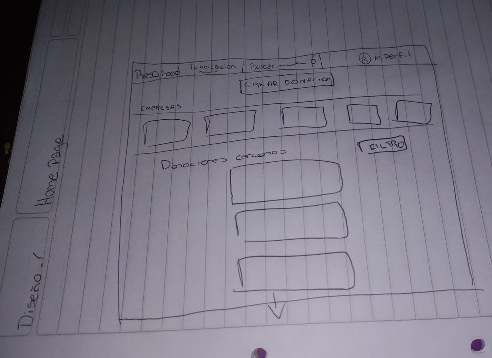

# ResQFood

## Equipo
- Gonzalo Bouso
- Milagros Villafañe
- Agustín Iturbe

## Índice
1. [Introducción](#introducción)
2. [Problema Identificado](#problema-identificado)
3. [Objetivo del Proyecto](#objetivo-del-proyecto)
4. [Impacto Esperado](#impacto-esperado)
5. [Descripción de la Solución](#descripción-de-la-solución)
6. [Características Principales](#características-principales)
7. [Flujo de Donaciones: Pasos y Detalles Funcionales](#flujo-de-donaciones-pasos-y-detalles-funcionales)
   -[Donación General](#donación-general)
   -[Donación Local(Empresas o Restaurantes)](#donación-local-empresas-o-restaurantes)
8. [Metodología de Trabajo](#metodología-de-trabajo)
9. [Equipo de Trabajo](#equipo-de-trabajo)
10. [Justificación del Stack Tecnológico (MERN) para ResQFood](#justificación-del-stack-tecnológico-mern-para-resqfood)
11. [Herramientas](#herramientas)
12. [Arquitectura del Proyecto](#arquitectura-del-proyecto)
13. [Diseño](#diseño)
14. [Diseño de la Home Page para Usuarios No Registrados](diseño-de-la-home-page-para-usuarios-no-registrados)

## Introducción
El desperdicio de alimentos es un problema global con importantes implicancias económicas, sociales y ambientales.Se estima que diariamente se descartan grandes cantidades de alimentos en buen estado debido a su proxima fecha de caducidad o por no ser utilizados. Este proyecto busca abordar esta problemática mediante el desarrollo de una plataforma que facilite la redistribución de alimentos no deseados, fomentando el aprovechamiento de los recursos y reduciendo el desperdicio.

## Problema Identificado
Los alimentos cercanos a su fecha de caducidad suelen ser desechados innecesariamente en hogares y establecimientos como restaurantes y supermercados. Este desperdicio no solo impacta en el medio ambiente, sino que también representa una perdida de recursos valiosos y una oportunidad desaprovechda de ayudar a quienes más lo necesitan.

## Objetivo del Proyecto
Desarrollar una aplicación móvil que permita:
1. Publicar alimentos que ya no necesitan, especificando detalles como tipo, cantidad y fecha de caducidad.
2. Localizar alimentos disponibles en su zona.
3. Coordinar la recolección de dichos alimentos de manera sencilla y eficiente.

## Impacto Esperado
1. Reducir significativamente el desperdicio de alimentos en el ambito doméstico y comercial.
2. Contribuir a una economía circular y sostenible.
3. Ayudar a personas en situación de necesidad a acceder a recursos alimenticios gratuitos.

## Descripción de la Solución
ResQFood funcionará como un puente entre quienes tienen alimentos en buen estado que no planean consumir y personas o instituciones que puedan aprovecharlos.
- **Para los donantes:** Podrán registrar alimentos de manera rápida, cargando una breve descripción, fotografía y detalles de disponibilidad.
- **Para los receptores:** Podrán buscar alimentos según su ubicación y necesidad, comunicándose directamente con los donantes a través de la aplicación.
- **Geolocalización:** La app incluirá mapas interactivos para facilitar el contacto entre usuarios cercanos.
## Características Principales
1. **Tipo de Usuario**  
   - Usuario General: Puede ser receptor o donador.
   - Usuario Local (Empresas o restaurantes): Solo puede ser donador.

   ###Requisitos de los Usuarios

   | Campo                  | Usuario (general) | Usuario (Local)        | Moderador          | Administrador      | Funcional | Visible |
|------------------------|--------------------|-------------------------|--------------------|--------------------|-----------|---------|
| Nombre                | ✅ Sí              | ✅ Sí                   | ✅ Sí              | ✅ Sí              | ✅ Sí      | ✅ Sí    |
| Email                 | ✅ Sí              | ✅ Sí                   | ✅ Sí              | ✅ Sí              | ✅ Sí      | ❌ No    |
| Teléfono              | ✅ Opcional        | ✅ Obligatorio          | ✅ Opcional        | ✅ Opcional        | ✅ Sí      | ✅ Sí    |
| Ubicación             | ✅ Opcional        | ✅ Obligatorio          | ❌ No aplica       | ❌ No aplica       | ✅ Sí      | ✅ Sí    |
| Foto de perfil        | ✅ Opcional        | ✅ Opcional             | ✅ Opcional        | ✅ Opcional        | ✅ Sí      | ✅ Sí    |
| Roles                 | “General”         | “Local”                | “Moderador”        | “Admin”           | ✅ Sí      | ❌ No    |
| Donaciones hechas     | ✅ Sí              | ✅ Sí                   | ❌ No aplica       | ❌ No aplica       | ✅ Sí      | ✅ Sí    |
| Donaciones recibidas  | ✅ Sí              | ❌ No aplica            | ❌ No aplica       | ❌ No aplica       | ✅ Sí      | ✅ Sí    |
| Tipo de negocio       | ❌ No aplica       | ✅ Rest./Panad./etc.    | ❌ No aplica       | ❌ No aplica       | ✅ Sí      | ✅ Sí    |
| Menú disponible       | ❌ No aplica       | ✅ Sí                   | ❌ No aplica       | ❌ No aplica       | ✅ Sí      | ✅ Sí    |
| Horario de atención   | ❌ No aplica       | ✅ Sí                   | ❌ No aplica       | ❌ No aplica       | ✅ Sí      | ✅ Sí    |
| Gestionar reportes    | ❌ No aplica       | ❌ No aplica            | ✅ Sí              | ✅ Sí              | ✅ Sí      | ❌ No    |
| Eliminar publicaciones| ❌ No aplica       | ❌ No aplica            | ✅ Sí              | ✅ Sí              | ✅ Sí      | ❌ No    |
| Suspender usuarios    | ❌ No aplica       | ❌ No aplica            | ❌ No aplica       | ✅ Sí              | ✅ Sí      | ❌ No    |
| Administrar roles     | ❌ No aplica       | ❌ No aplica            | ❌ No aplica       | ✅ Sí              | ✅ Sí      | ❌ No    |
| Acceso total al sistema| ❌ No aplica       | ❌ No aplica            | ❌ No aplica       | ✅ Sí              | ✅ Sí      | ❌ No    |

2. **Registro y Autenticación**: Los usuarios deberán crear una cuenta para participar.
3. **Publicación de Alimentos**: Los donantes podrán especificar detalles sobre los alimentos disponibles

###Requisitos de las publicaciones

| Campo                  | Obligatorio | Descripción                                              | Funciona | Visible en publicación |
|------------------------|-------------|----------------------------------------------------------|----------|-------------------------|
| Título                | ✅ Sí       | Breve descripción del alimento (Ej: "Caja de frutas variadas") | ✅ Sí    | ✅ Sí                  |
| Descripción           | ✅ Sí       | Detalles adicionales sobre el alimento                   | ✅ Sí    | ✅ Sí                  |
| Imagen del alimento   | ✅ Sí       | Foto del alimento para mostrar su estado                 | ✅ Sí    | ✅ Sí                  |
| Cantidad disponible   | ✅ Sí       | Número de porciones o unidades disponibles               | ✅ Sí    | ✅ Sí                  |
| Categoría             | ✅ Sí       | Tipo de alimento (Ej: "Frutas", "Verduras", etc.)        | ✅ Sí    | ✅ Sí                  |
| Fecha de V.           | ✅ Sí       | Fecha límite para consumir el alimento                   | ✅ Sí    | ✅ Sí                  |
| Ubicación de retiro   | ✅ Sí       | Dirección o zona para retirar la donación                | ✅ Sí    | ✅ Sí                  |
| Método de entrega     | ✅ Sí       | Retiro en persona o entrega a domicilio (si aplica)      | ✅ Sí    | ✅ Sí                  |
| Horario de disponibilidad | ✅ Sí    | Franja horaria para retirar el alimento                  | ✅ Sí    | ✅ Sí                  |
| Estado del alimento   | ✅ Sí       | Opciones como "Fresco", "Congelado", etc.                | ✅ Sí    | ✅ Sí                  |
| Condiciones especiales| ❌ No       | Notas como "Debe ser refrigerado", etc.                  | ✅ Sí    | ✅ Sí                  |
| Información de contacto | ✅ Sí     | Teléfono o email para coordinar la entrega               | ✅ Sí    | ✅ Sí                  |
| Donación anónima      | ❌ No       | Si el usuario desea que no se muestre su nombre          | ✅ Sí    | ✅ Sí                  |

4. **Búsqueda y Filtrado**: Los receptores podrán buscar alimentos según categoría, ubicación o cercanía a la fecha de caducidad.
5. **Reservación de Alimentos**: El usuario receptor podrá seleccionar un alimento en una publicación, que al ser aprobado por el donante el alimento dejará de estar disponible.
6. **Notificaciones**: Alertas para donantes y receptores sobre nuevas publicaciones o solicitudes
7. **Sistema de Calificaciones**: Para garantizar la confianza y transparencia entre los usuarios.

## Flujo de Donaciones: Pasos y Detalles Funcionales
### Donación General

1. El donador publica una donación con foto, información del producto y detalles relevantes.
2. El producto aparece en el feed de receptores cercanos.
3. Un receptor solicita el producto.
4. El donador recibe una notificación, acepta la solicitud y establece un horario de entrega.
5. El receptor confirma el horario y acepta los términos de entrega.
   - El producto cambia su estado a **"pendiente"**, lo que significa que sigue visible pero no puede ser solicitado por otros receptores.
   - Si la entrega no se completa y el donador no ingresa el código de confirmación, el producto volverá a estar disponible.
6. Se genera un código ID para el receptor, referenciando al producto.
7. El donador ingresa el código ID para confirmar la entrega.
8. Se le notifica al receptor con un resumen de la donacion que recibio (Id de entrega, ubicacion, horario y detalles del producto)
9. El producto deja de estar disponible en la plataforma.
10. Se eliminan las otras solicitudes del producto.
11. El receptor puede puntuar al donador.

### Donación Local (Empresas o Restaurantes)
1. Creación de perfil de empresa con información, dirección y horarios de atención.
2. La empresa publica opciones de donaciones con foto, información del producto, precio y descuento para el “plato solidario”.
3. Un cliente decide hacer una donación.
- Ingresa al perfil del local.
- Selecciona el producto
- Solicita hacer la donacion

4. El cliente recibe un código único en pantalla del producto donado.
5. La empresa recibe la solicitud del cliente.
6. El cliente paga en efectivo.
7. La empresa ingresa el código brindado por el cliente.
8. El producto se publica como donación disponible en la plataforma.

## Metodología de Trabajo
Uso de **Scrum** para gestionar el desarrollo del proyecto.
Para gestionar el desarrollo del proyecto, se empleará la metodología Scrum, que permitirá la entrega iterativa de funcionalidades y la mejora continua a través de la retroalimentación.
- **Duración de Sprints:** 1 semana.
- **Sprint Review y Retrospective:** Jueves a las 10:30 AM.
- **Sprint Planning:** Todos los miercoles.
- **Daily Meetings:** Lunes a viernes a las 10:00 AM (15 min).

### Equipo de Trabajo
- **Scrum Master:** Gonzalo Bouso
- **Líder Frontend:** Agustín Iturbe
- **Líder Backend:** Milagros Villafañe
- **Encargado de Testing:** Gonzalo Bouso
- **Encargado de Documentación:** Milagros Villafañe
- **Encargado del manejo de Trello:** Agustín Iturbe

## Justificación del Stack Tecnológico (MERN)
El MERN Stack (MongoDB, Express.js, React, Node.js) es una de las tecnologías más adecuadas para desarrollar una red social como ResQFood, que conecta a personas que desean donar alimentos con aquellas que los necesitan. La elección de este stack se basa en los siguientes factores:
1. **Desarrollo Full-Stack con JavaScript**: El uso de JavaScript en todo el stack (frontend, backend y base de datos) simplifica el desarrollo, ya que permite mantener un único lenguaje de programación en toda la aplicación. Esto ofrece:
✅ Código más limpio y reutilizable, evitando la necesidad de cambiar entre lenguajes.
✅ Menor curva de aprendizaje, ya que todos los desarrolladores pueden trabajar tanto en frontend como en backend sin problemas.
✅ Eficiencia en el desarrollo, permitiendo una mejor colaboración dentro del equipo.

2. **Escalabilidad y Manejo de Datos en Tiempo Real**: Como la plataforma funcionará como una red social, es fundamental que maneje eficientemente un gran volumen de datos y usuarios. MERN ofrece ventajas clave:
✅ MongoDB es una base de datos NoSQL altamente escalable y flexible. Permite almacenar publicaciones de donaciones, usuarios y comentarios de manera eficiente.
✅ React.js facilita la actualización dinámica de la interfaz sin recargar la página, mejorando la experiencia del usuario.
✅ Node.js y Express manejan múltiples solicitudes concurrentes sin perder rendimiento, asegurando un backend rápido y estable

3. **Integración con Funcionalidades Clave para una Red Social**: El stack MERN se adapta perfectamente a los requerimientos de una red social como ResQFood, incluyendo:
✅ Publicación y gestión de alimentos: MongoDB permite almacenar publicaciones con imágenes, descripciones y geolocalización.
✅ Sistema de usuarios y autenticación: Node.js y JWT garantizan una autenticación segura y escalable.
✅ Geolocalización en tiempo real: React puede integrarse con Google Maps API para mostrar las donaciones cercanas a cada usuario.
✅ Notificaciones en tiempo real: WebSockets con Node.js pueden usarse para alertar a los usuarios sobre nuevas donaciones.

4. **Comunidad y Soporte Activo**: ✅ MERN es una tecnología ampliamente adoptada, con una gran comunidad de desarrolladores y documentación disponible, lo que facilita la resolución de problemas y futuras mejoras en el sistema.

### Conclusión :
 El MERN Stack ofrece una combinación ideal de velocidad, escalabilidad, facilidad de desarrollo e integración con funcionalidades clave para redes sociales. Su arquitectura basada en JavaScript en todo el stack, permite desarrollar ResQFood de manera eficiente y preparada para el crecimiento futuro. 🚀

## Herramientas
1. **Trello:** Gestión de tareas.
2. **Jira:** Seguimiento de bugs y testing.
3. **GitHub:** Control de versiones.
4. **Notion/Google Docs:** Documentación colaborativa.

## Arquitectura del Proyecto
Se ha optado por una **arquitectura de cliente-servidor** brindando mayor flexibilidad, escalabilidady facilidad de mantenimiento.

### Ventajas de la Arquitectura cliente-servidor
- **Escalabilidad**
- **Seguridad**
- **Mantenimiento eficiente**
- **flexibilidad**
- **Mejor UX**

## Diseño
A continuación, se presenta un primer boceto de la pantalla de inicio (Home Page) de ResQFood. Este diseño no es definitivo y servirá como base para futuras iteraciones.

### Secciones Clave
1. Hero Section (Encabezado Principal)
**Objetivo**: Captar la atención del usuario y explicar la misión de ResQFood.
**Elementos**:
- Fondo visual llamativo: Imagen de personas compartiendo comida o una ilustración representativa.
- Mensaje principal: "Dale una segunda oportunidad a la comida y ayuda a quienes lo necesitan."
- Botones de acción (CTA):
  o	"Regístrate Gratis" (llamada a la acción principal).
  o	"Explorar donaciones" (permite ver publicaciones sin registrarse).

2. ¿Cómo Funciona ResQFood?
**Objetivo**: Explicar de forma simple cómo se usa la plataforma.
**Elementos**:
-	Infografía con 4 pasos:
1.	Regístrate como usuario general o local.
2.	Publica o solicita donaciones cerca de tu ubicación.
3.	Coordina la entrega de los alimentos.
4.	¡Reduce el desperdicio y ayuda a quienes lo necesitan!
-	Botón CTA: "Empieza Ahora" (redirige a la página de registro).

3. Últimas Donaciones Disponibles (Vista Limitada)
**Objetivo**: Mostrar ejemplos de donaciones reales para incentivar el registro.
**Elementos**:
-	Tarjetas de donaciones recientes con información parcial:
o	Imagen del alimento (con marca de agua o difuminada).
o	Nombre genérico (ejemplo: "Comida casera", "Frutas variadas").
o	Ubicación aproximada (sin dirección exacta).
o	**Mensaje**: "Regístrate para ver más detalles y solicitar donaciones."
-	**Botón CTA**: "Ver más donaciones" (redirige a registro).

4. Beneficios de Unirte a ResQFood
**Objetivo**: Explicar por qué vale la pena registrarse.
Elementos:
-	**Listado de beneficios con íconos**:
o	Accede a donaciones gratuitas.
o	Ayuda a reducir el desperdicio de alimentos.
o	Forma parte de una comunidad solidaria.
o	Registra tu negocio y dona de manera fácil.
-	**Botón CTA**: "Regístrate Ahora".

5. Testimonios de Usuarios
**Objetivo**: Mostrar experiencias positivas de personas que usan la plataforma.
**Elementos**:
-	Frases cortas de usuarios reales (ejemplo: "Gracias a ResQFood, recuperé alimentos en buen estado y ayudé a otros.").
-	Fotos de perfil (opcional, puede ser anónimo).

6. Sección para Empresas y Locales Gastronómicos
**Objetivo**: Incentivar a negocios a registrarse y participar.
**Elementos**:
-	**Mensaje clave**: "Si tienes un restaurante, supermercado o panadería, puedes donar tu excedente y reducir desperdicio."
-	**Botón CTA**: "Registra tu negocio".

7. Footer (Pie de Página)
**Objetivo**: Proveer información adicional.
**Elementos**:
-	Enlaces a "Términos y Condiciones", "Política de Privacidad" y "Contacto".
-	Íconos de redes sociales para seguir a la plataforma.
Diseño y Estilo:
-	**Responsivo**: Adaptado para móviles y computadoras.
-	Minimalista y atractivo: Uso de colores cálidos y amigables.
-	**Contenido restringido**: Algunas funcionalidades solo accesibles al registrarse.

### Diseño de la Home Page para Usuarios Registrados

El Home Page para usuarios generales registrados se centra en mostrar contenido personalizado, facilitar la interacción con donaciones y fomentar la actividad en la plataforma.

**Secciones Clave**
1. Barra de Navegación (Header Fijo)
**Objetivo**: Facilitar el acceso a las secciones clave de la plataforma.
**Elementos**:
-	Logo de ResQFood (clickeable para volver al home).
-	**Menú de navegación con enlaces a**:
o	Inicio
o	Explorar Donaciones
o	Mis Publicaciones
o	Notificaciones (con indicador de nuevos mensajes).
o	Perfil del Usuario.
-	Botón "+ Nueva Donación" para publicar alimentos disponibles.

2. Sección de Bienvenida Personalizada
**Objetivo**: Hacer que el usuario se sienta identificado y motivado a interactuar.
**Elementos**:
-	**Mensaje de bienvenida con su nombre**: "Hola, [Nombre del Usuario] 👋 ¿Listo para compartir y recibir alimentos hoy?"
-	**Opciones rápidas**:
o	"Publicar una Donación" (CTA principal).
o	"Explorar donaciones cerca de ti".

3. Donaciones Cercanas (Feed Principal)
**Objetivo**: Mostrar las donaciones disponibles en su zona.
**Elementos**:
-	**Lista de publicaciones de donaciones en tarjetas con**:
o	Imagen del alimento.
o	Nombre descriptivo (ejemplo: "Pan fresco disponible", "Comida casera en buen estado").
o	Ubicación aproximada.
o	Tiempo restante antes de que expire la donación.
o	Botón "Solicitar" para enviar un mensaje al donador.
-	Filtros y búsqueda avanzada:
o	Por ubicación (mostrar solo donaciones cercanas).
o	Por fecha de publicación.
o	Por tipo de alimento (panadería, frutas, comida preparada, etc.).

4. Mis Últimas Interacciones
**Objetivo**: Mostrar un resumen de la actividad del usuario.
**Elementos**:
-	Publicaciones realizadas recientemente.
-	Solicitudes de donación enviadas y su estado (pendiente, aceptada, rechazada).
-	Mensajes recientes con otros usuarios.

5. Sección de Comunidad y Testimonios
**Objetivo**: Fomentar la confianza y participación en la plataforma.
**Elementos**:
-	Historias de éxito de otros usuarios.
-	Invitación a compartir su experiencia con una nueva publicación.

6. Notificaciones y Recomendaciones
**Objetivo**: Mantener al usuario informado sobre actividad relevante.
**Elementos**:
-	**Notificaciones recientes sobre**:
o	Nuevos mensajes de otros usuarios.
o	Confirmación de solicitudes de donación.
o	Nuevas donaciones cercanas disponibles.
-	**Recomendaciones personalizadas**:
o	"Basado en tu ubicación, hay 3 donaciones disponibles ahora."
o	"Hay un evento comunitario cerca de ti. ¿Te gustaría participar?"

7. Botón Fijo de Acción Rápida
**Objetivo**: Facilitar acciones comunes desde cualquier parte del sitio.
**Elementos**:
-	**Botón flotante en la esquina con accesos rápidos a**:
o	Publicar nueva donación.
o	Explorar donaciones.
o	Mensajes recientes.

8. Footer (Pie de Página)
**Objetivo**: Proveer información adicional y enlaces útiles.
**Elementos**:
-	Enlaces a políticas, soporte y redes sociales.
-	Opción para invitar amigos a la plataforma.
Diseño y Experiencia:
-	Interfaz amigable y dinámica con información relevante en primer plano.
-	Personalización según el historial y ubicación del usuario.
-	Facilidad de uso con acciones rápidas y notificaciones en tiempo real.
