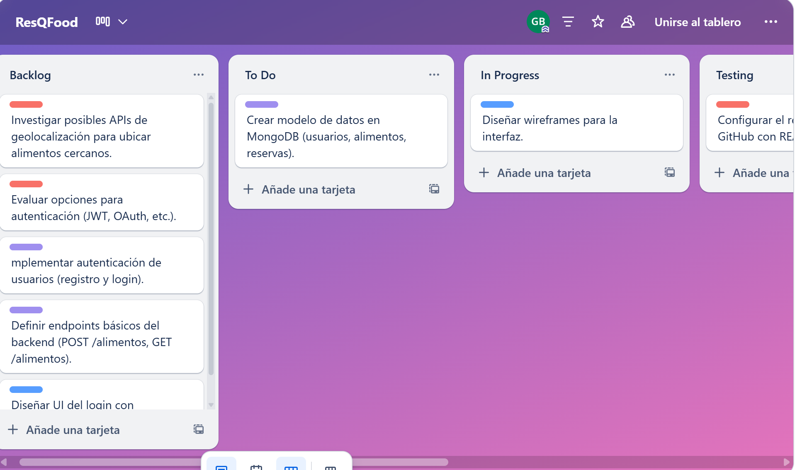
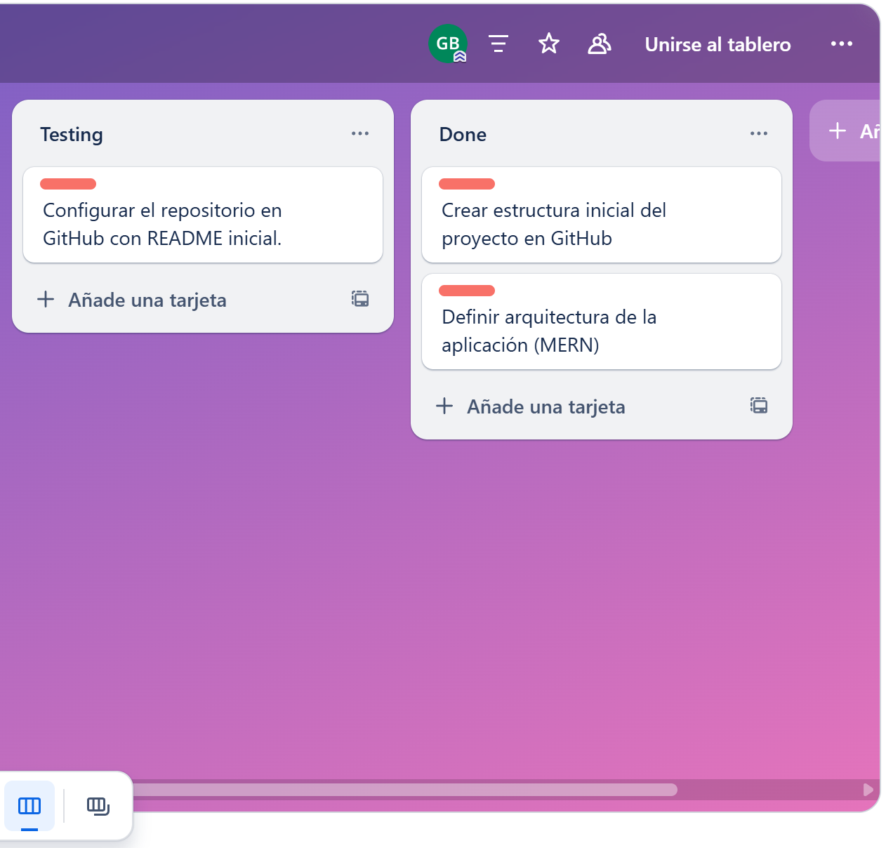
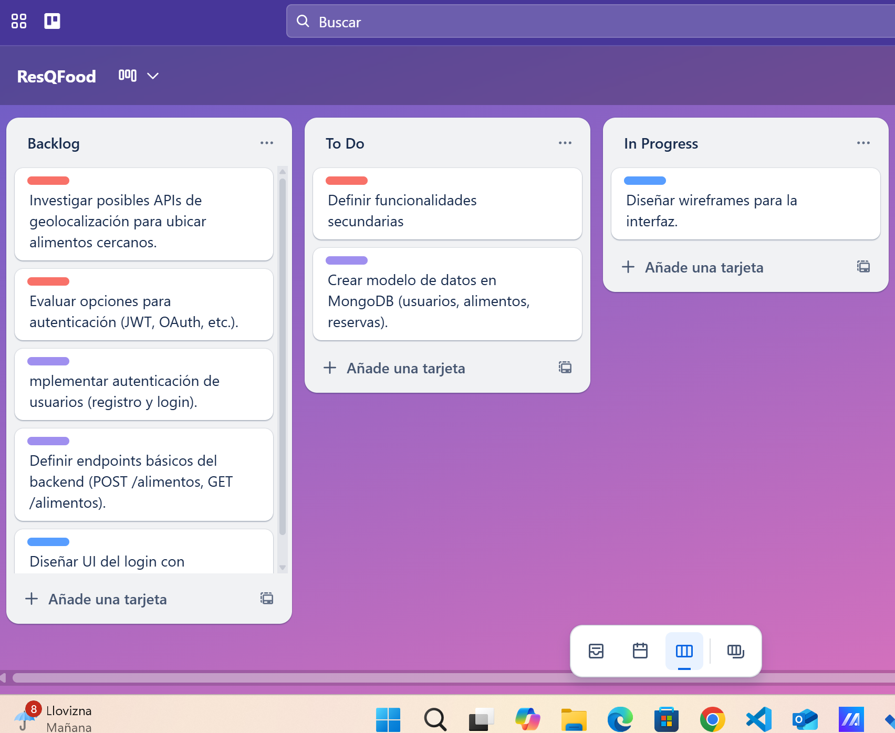
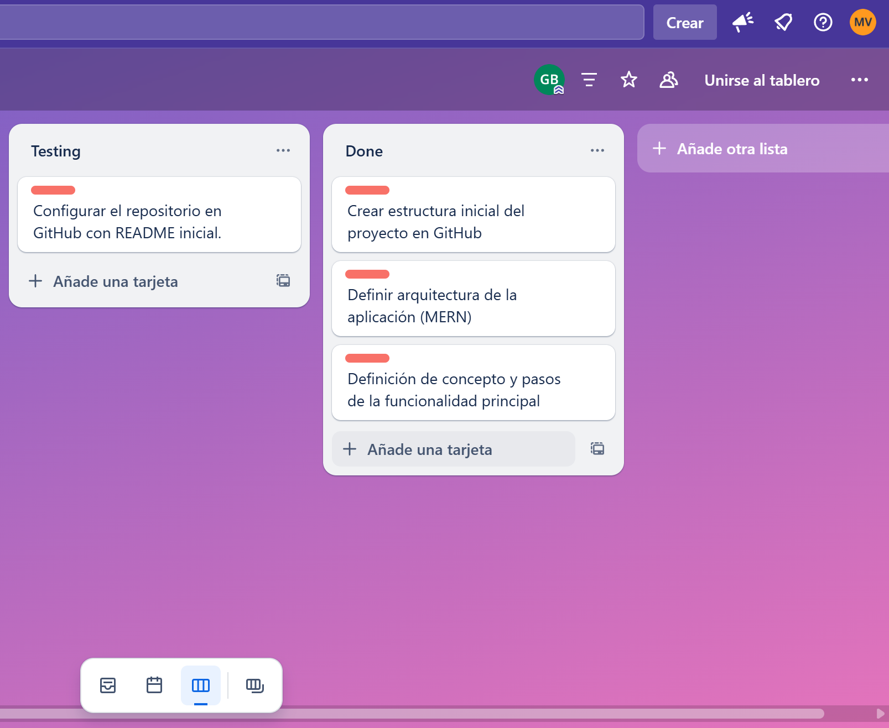
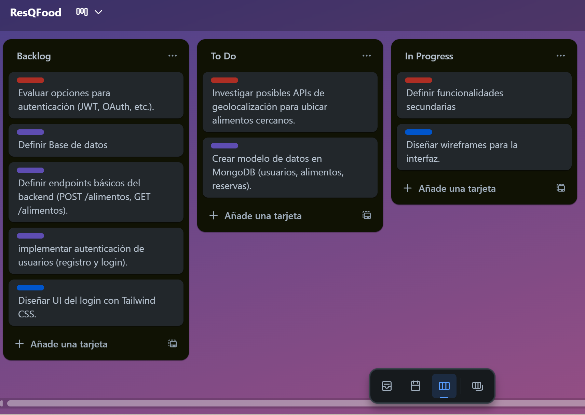
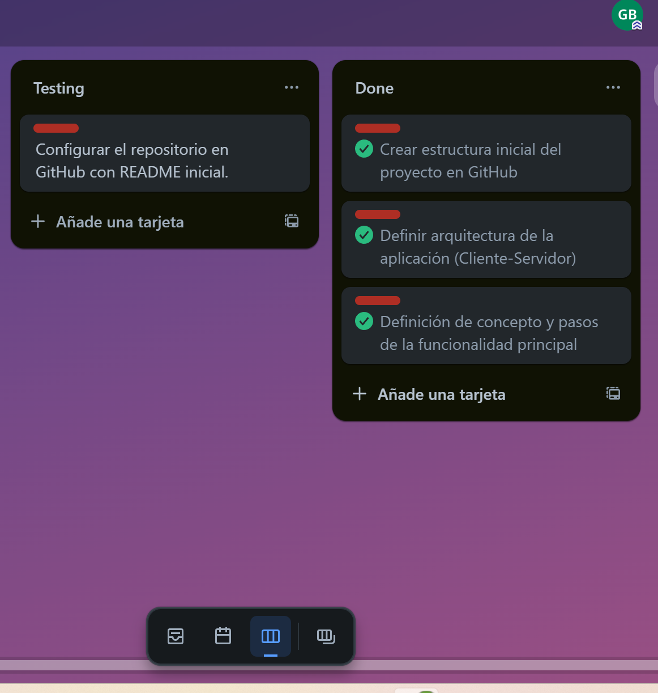

# TRELLO
## Introducción
El tablero de Trello es la herramienta principal que utilizamos  en el equipo para gestionar tareas de desarrollo de la aplicación **ResQFood**.  
Nos permite organizar, priorizar y hacer seguimiento del avance de las tareas según la metodología **scrum**

## Estructura del tablero
El orden de las listas del tablero es el siguiente:

- **Backlog**: Contiene las tareas planificadas que aún no fueron asignadas a un sprint en curso.
- **To Do**: Incluye las tareas seleccionadas para el sprint en curso. Son las tareas que están listas para ser tomadas por los integrantes del equipo.
- **In Progress**: Tareas en proceso de desarrollo.
- **Testing**: Aquí se colocan las tareas que ya fueron desarrolladas y están esperando revisión de código o pruebas de funcionamiento.
- **Done**: Tareas completadas y aprobadas.

## Clasificación por colores
- 🟦 **Azul**: Tareas **Front end**.
- 🟪 **Morada**: Tareas **Back end**.
- 🟥 **Roja**: Tareas **generales o de configuración**, que no pertenecen exclusivamente al frontend ni al backend.

## Registro Diario de Cambios

02/03/2025

03/04/2025

01/04/2025

